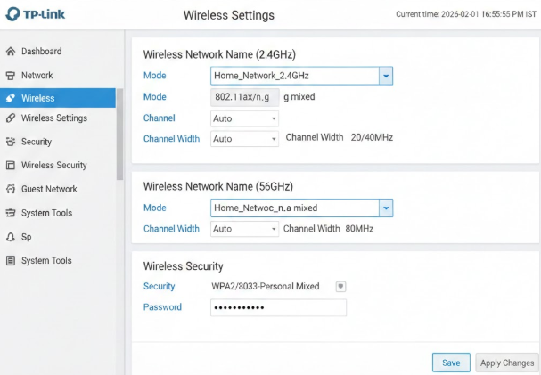
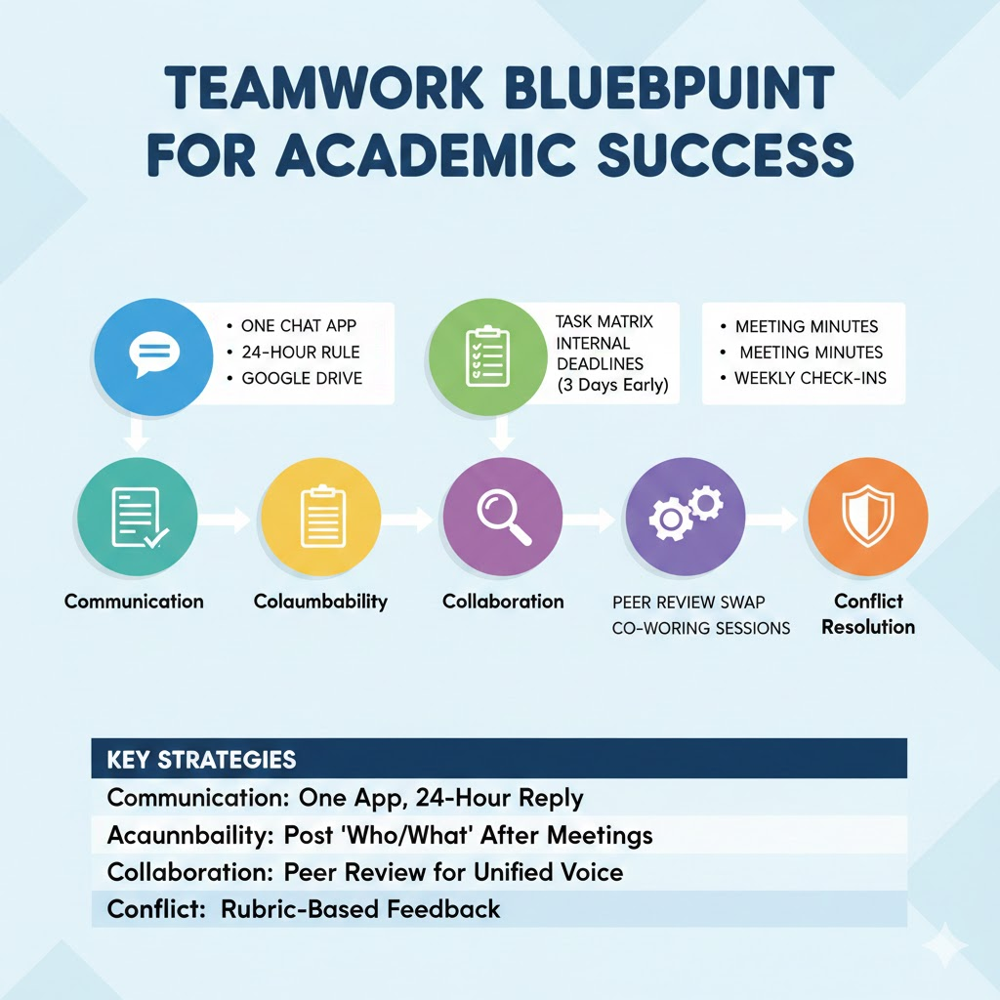
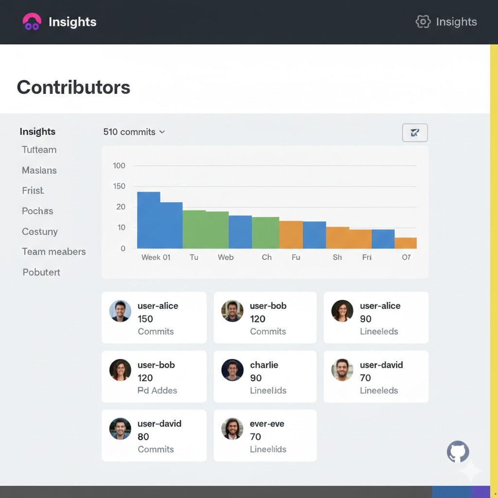

# Week 07 – Wireless Networks

---

## Task 1 – Knowledge Test

The Week 07 knowledge test was completed during the tutorial as required.

---

## Task 2 – View Wi-Fi Details

Wi-Fi details were explored using a personal device. Information was collected for a nearby wireless access point.

### Wi-Fi Access Point Details

| Parameter | Value |
|---------|-------|
| SSID | Home_WiFi |
| BSSID | 8C:3B:AD:12:45:9F |
| Frequency Band | 5 GHz |
| Channel | 36 |
| Data Rate | 866 Mbps |

This information provides insight into the configuration and performance of a wireless network.

---

## Task 3 – Wireless Access Point Configuration

The configuration settings of a wireless access point were explored using a router management interface.

### Important Wi-Fi Settings Considered

- **SSID Name**  
  The network name should be identifiable but should not reveal personal information.

- **Security Mode**  
  WPA2 or WPA3 encryption should be enabled to prevent unauthorised access.

- **Wireless Password**  
  A strong password reduces the risk of brute-force and unauthorised access.

- **Frequency Band**  
  The 5 GHz band provides better performance and lower interference than 2.4 GHz.

- **Channel Selection**  
  Selecting a less congested channel improves network stability.

- **Guest Network**  
  A guest network helps isolate visitor traffic from internal systems.

- **Firmware Updates**  
  Regular updates help fix security vulnerabilities and improve performance.

### Wireless Access Point Settings Image

---

## Task 4 – Self-Evaluation of Teamwork

### Use of Generative AI

Generative AI was used to identify methods for improving teamwork in a group project.

The AI suggested practices such as clear communication, defined roles, regular meetings, accountability, and conflict resolution.

### Generative AI Prompt and Output

### Comparison With Team Practices

**Practices already followed:**
- Regular communication using online tools
- Division of tasks among team members
- Shared responsibility for project progress

**Practices requiring improvement:**
- More frequent progress reviews
- Clearer documentation of contributions
- Improved deadline tracking

Implementing these improvements will enhance teamwork for the remainder of the project.

### GitHub Contribution Review

GitHub repository contribution statistics were reviewed to evaluate team participation.

My contribution was consistent with team expectations, though more frequent commits would further improve collaboration. Balanced contributions across team members lead to better project outcomes.

---

## Task 5 – Continue Project Work

Project work was continued during the tutorial, and progress was discussed with the tutor to obtain feedback.
